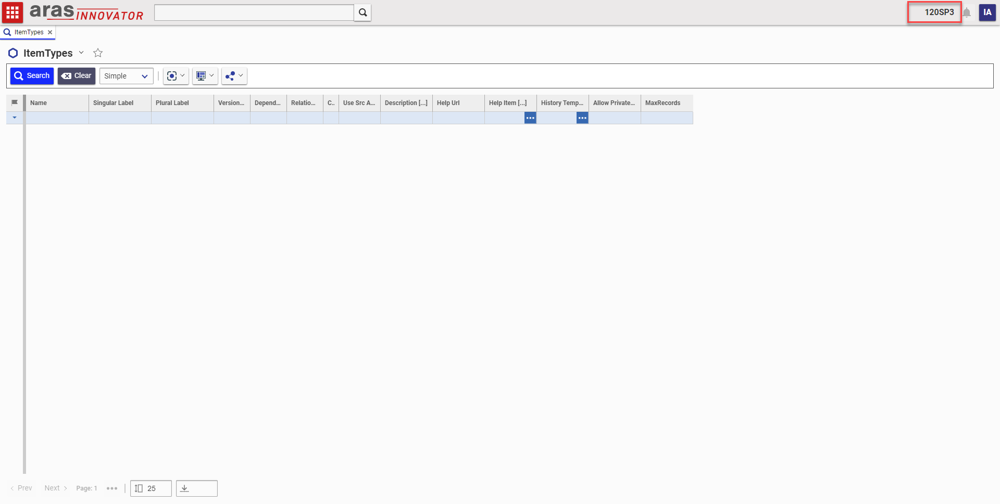

# Database Name In Header

Uses CUI to add the database name to the header bar of Aras Innovator for administrator users.

## History
This project and the following release notes have been migrated from the old Aras Projects page.

Release | Notes
--------|--------
[v1.0.0](https://github.com/ArasLabs/database-name-in-header/releases/tag/v1.0.0) | Initial Release

#### Supported Aras Versions

Project | Aras
--------|------
[v1.0.0](https://github.com/ArasLabs/database-name-in-header/releases/tag/v1.0.0) | 12.0 SP1, 12.0 SP3

## Installation

#### Important!
**Always back up your code tree and database before applying an import package or code tree patch!**

### Pre-requisites
1. Aras Innovator installed
2. Aras Package Import tool
3. **aras.labs.cui.databaseNameInHeader** import package

### Install Steps

#### Database Installation
1. Backup your database and store the BAK file in a safe place.
2. Open up the Aras Package Import tool.
3. Enter your login credentials and click **Login**
  * _Note: You must login as root for the package import to succeed!_
4. Enter the package name in the TargetRelease field.
  * Optional: Enter a description in the Description field.
5. Enter the path to your local `..\Database Name in Header\Imports\imports.mf` file in the Manifest File field.
6. Select both packages in the Available for Import field.
7. Select Type = **Merge** and Mode = **Thorough Mode**.
8. Click **Import** in the top left corner.
9. Close the Aras Package Import tool.

## Usage

1. Login as admin
	* This action will be hidden from non-adminsitrator users
2. Confirm that you can see the database name in the header bar

## Contributing

1. Fork it!
2. Create your feature branch: `git checkout -b my-new-feature`
3. Commit your changes: `git commit -am 'Add some feature'`
4. Push to the branch: `git push origin my-new-feature`
5. Submit a pull request

## Credits

Created by Christopher Gillis for Aras Labs. @cgillis-aras

## License

Published to Github under the MIT license. See the [LICENSE file](./LICENSE.md) for license rights and limitations.